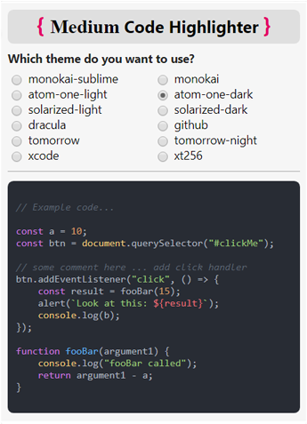
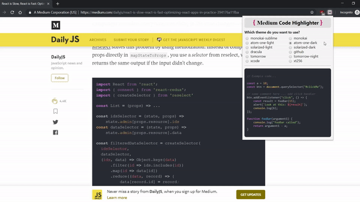

	

<h1 align="center">Medium Code Highlighter</h1>

	
	
	
	
	

Syntax highlighting on Medium articles that's simple and easy via a browser extension.  

Install it from the [Chrome Webstore](https://chrome.google.com/webstore/detail/medium-code-highlighter/apdaagmhepellbjjbnaljaocodjjjjfd).

---

	
	&nbsp;&nbsp;&nbsp;&nbsp;&nbsp;&nbsp;&nbsp;&nbsp;&nbsp;
	

	

 

A chrome browser extension which adds code syntax highlighting to Medium articles.  
Forget the black-on-gray blobs of code in articles which don't embed gists or images of code!

## Highlights

- Adds code syntax highlighting to `<pre>` blocks in Medium articles.
- Highlighting theme is selectable and can be changed on-the-fly (via extension popup upon icon-click) from a handful of popular themes.
  - Theme preference links to Chrome account.
- Works on all Medium articles, regardless of domain (i.e. `medium.com`, `medium.freecodecamp.org`, `hackingandslacking.com`, etc.)
 

**Note**  
Due to Medium's innate formatting, code blocks are split line-by-line into `<pre>` blocks, meaning the `highlightjs` language syntax recognizer may sometimes have trouble, but for the most part it works acceptably well.

## Credits
Uses [highlightjs](https://github.com/highlightjs/highlight.js) for highlighting.  
Styles modified slightly to better fit Medium articles.

## License 
MIT © [Mac Baler](https://macbaler.me)
